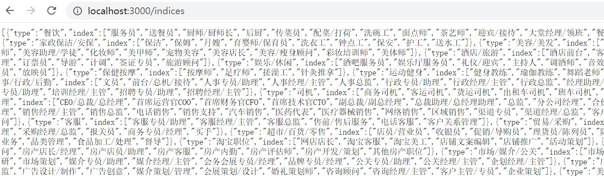
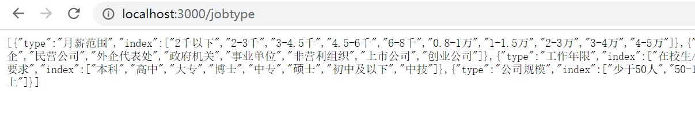

# JS


#### 运行

- 用node-dev 实现热部署 `npm run dev`


#### 框架

- 前端 vue.js
- 后端 express
- 数据库 mysql

#### restful API

- indices

  

- jobtype

  

- user  ***还没写***
#### 正则表达式

- 判断密码强弱

```js
var s1 = "123456"
var s2 = "jjjj5678"
var s3 = "12&*(3456j+))(*&"


function testPassWord(password) {
	var res = 0;
	var patterns = [/\d+/,/[.*+?^${}()|[\]\\]+/,/[a-zA-Z]/]
	for(i of patterns){
		if(i.test(password)){
			res++;
		}
	}
	return res
}
console.log(testPassWord(s1));//-> 1
console.log(testPassWord(s2));//-> 2
console.log(testPassWord(s3));//-> 3
```

