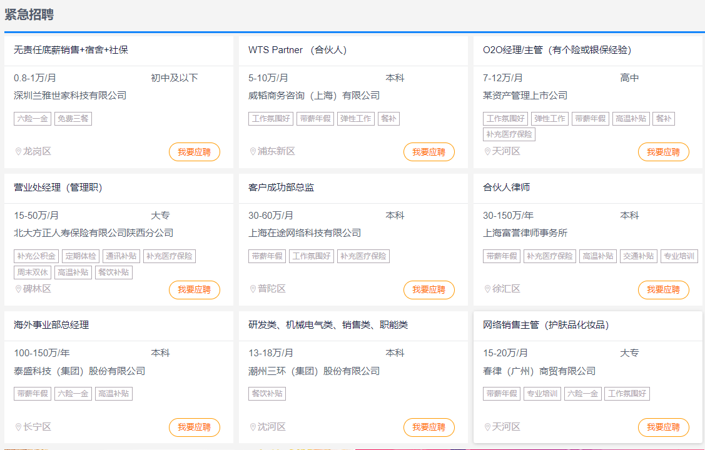
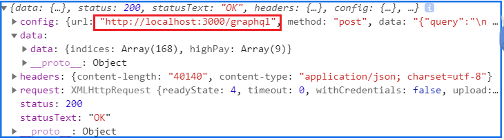

# 2019-2020学年第2学期
# **实 验 报 告**


- 课程名称:跨平台脚本开发技术
- 实验项目: 大作业
- 专业班级:计算机1701
- 学生学号:31701005 31703032
- 学生姓名: 郑诗雨   戴佳莱
- 实验指导教师:郭鸣


[toc]


### 项目说明
- 项目是独立开发

- 实现采用跨平台技术,包括服务端与浏览器端
- 求职网站

#### 运行

- 用node-dev 实现热部署 `npm run dev`

#### 框架

- 前端 vue.js
	- 包结构
- 后端 express
	- 包结构 
- 数据库 mysql、elasticsearch
#### 页面介绍
##### 首页（graphql）
- 前端


- 技术 graphql


```js
//用到的包
const { buildSchema } = require('graphql')
const graphqlHTTP = require('express-graphql')

const schema = buildSchema(`
    type Job {
        name: String
        company: String
        salary: String
        require: String
        addr: String
        welfare:[String]
    }
    type Index{
        type: String
        index: [String]
    }
    type Query {
        highPay(limit:Int):[Job]
        indices:[Index]
    }
`)
```

- 接口
`/graphql`
```graphql
    GET /graphql 
query{
  indices {
    type
    index
  }
  highPay(limit:9) {
    name
    company
    salary
    require
    addr
    welfare
  }
}
   
```

##### 搜索页面(响应式编程、ElasticSearch)
- 前端![]
	- Desktop !(img/响应式设计-1.png)
	- phone 
- 技术 elasticsearch
	- es部署在服务器上
	- 利用elasticsearch 来进行搜索查询，elastcsearch自带倒排索引和简单的结果排序。通过es自带的bulk接口将爬虫获得的json文件插入其中。然后通过es带的restful API进行查询
	- 响应式设计
 ```css
 @media  screen and (min-width: 481px) and (max-width :1740px){...}
 ```
- 接口 
```json
POST http://120.76.192.9:9200/company2/_search
{
  "query": {
    "bool": {
      "must": [
        { "match": { "comp_type_id": 4} },
        { "match": { "comp_size_id": 5} }
      ],
      "should": [
        { "multi_match": {
            "query":"输入的搜索词",
            "fields":["comp_info","comp_name"]
            } 
        }
      ]
    }
  }
}
```

##### 用户界面(session)
- 前端  
- 技术 session
	- 用户登录时生成session，存储在redis缓存中，用户退出登录时将session删除
	- 用户登录或注册用户时，使用MD5将密码加密。
	- redis 部署在服务器上
```js
var ioRedis = require('ioredis');
var redis = new ioRedis(6379,'39.98.131.44');

app.use(session({
  store:new redisStore({
    client:redis,
    prefix:'hgk'
  }),
  cookie:{maxAge:1*60*60*1000},
  secret:'keyboard cat',
  resave:true,
  saveUninitialized:true
}))
```
```js
//存储session
req.session.phone = data.phone
req.session.save();
//删除session
delete req.session.phone;
```

- RESTful 接口
- /users

  - POST /users #注册
  - PUT /users/:id #改密码
  - DELETE /users/:id #注销用户

- /session

  - POST /session 登陆
  - DELETE /session 登出


#### NPM发布
`npm pulish`


### 解决技术要点说明
- 跨域
	- 前端和后端端口不同 所以在后端设置了`app.use(cors())`
	- elasticsearch在服务器上 不允许跨域，所以在服务器上设置了一下elastsearch的配置文件
	- graphql被路由至单独提供的graphql服务器所以为graphql单独配置跨域`app.use('/graphql',cors(), graphglRouter)`

- 同步异步 
	- 异步不利于数据库的读写所以用`async` `await`关键字实现同步
	- http的异步有些地方采用promise的链式调用

- axios GET不能发送body elasticsearch的官方文档是通过get带body的形式发送 一直获取的是默认的返回 body没有用 然后改成了post就好了。


- ramda函数式编程


```js
//修改之前
var s1 = "123456"
var s2 = "jjjj5678"
var s3 = "12&*(3456j+))(*&"


function testPassWord(password) {
	var res = 0;
	var patterns = [/\d+/,/[.*+?^${}()|[\]\\]+/,/[a-zA-Z]/]
	for(i of patterns){
		if(i.test(password)){
			res++;
		}
	}
	return res
}
console.log(testPassWord(s1));//-> 1
console.log(testPassWord(s2));//-> 2
console.log(testPassWord(s3));//-> 3

//修改之后
function check(password){
    var res = 0;
    var l = [/\d+/,/[.=*+?^${}()|[\]\\]+/,/[a-zA-Z]/]
    var ddd = (a) => R.test(a)(this.password)
    return  R.reduce(R.add,0)(R.map(ddd,l))
}
console.log(check(s1));//-> 1
console.log(check(s2));//-> 2
console.log(check(s3));//-> 3
```

```js
const byTypeName = R.groupBy(function (row){
    return row.type_name;
})
var result = []
function deal (value,key){
    result.push({"type":key,"index":R.pluck('index_name')(value)})
}


R.forEachObjIndexed(deal,byTypeName(rows))
```
其他地方的for循环多采用array自带的`foreach`、`map`、`reduce`等


### 项目分工表格
| 姓名   | 学号     | 班级       | 任务         | 权重 |
| ------ | -------- | ---------- | ------------ | ---- |
| 戴佳莱 | 31703032 | 计算机1701 | 前端 vue     | 1.0  |
| 郑诗雨 | 31701005 | 计算机1701 | 后端 express | 0.9  |

### 自我评估表

| 函数式编程 | axios | FRP  | session Storage | 响应式设计(Desktop/Tablet/Mobile) |others|
| ---------- | --------- | ---- | --------------- | --------------------------------- | ----- |
| 5          | 5         |    | 5               | 5                                | 0     |

| others  | 自我评估 |
| ------- | -------- |
| NPM     | 5        |
| redis   | 5        |
| graphql | 5        |
| RESTful | 5        |
| Ramda   | 5        |


### 项目自评等级:(1-5)

- 原创性 (1-5) 5

- 技术难度 (1-5) 4.8

- 工作量 (1-5) 5


### 心得体会
> 大项目开发过程心得
遇到哪些困难，经历哪里过程，有哪些收获
本课程建议
课程难度方面，进度方面，课程内容，授课方式等，给出你的意见


##### 郑诗雨

- 开发过程心得

在本次大作业中使用了`graphql`、`restful`这两种不同的接口，对后端的影响似乎不大，graphql可以一次请求多个数据、取想要的字段，主要方便了前端操作，减少沟通、修改的成本。

第一次用JS写了一个完整的后端代码，并在代码中努力使用函数式编程。和过程式编程不同的思维模式，熟悉花了很久的时间，熟悉`ramda`自带的方法也花了一定的时间，总是想方设法想写纯函数，但有时候写纯函数又感觉很重复，就有些难取舍。

因为是小组作业所以把mysql、elasticsearch、redis都部署在了服务器上，方便两个人使用。重新熟悉和学习了了一下整个部署的过程

- 课程建议
  - 个别几周的平时作业稍微会有一点点多。
  - 难度适中，有时候有挑战性，挺好
  - 课后作业还是希望有个交流、反馈的地方

##### 戴佳莱

- 开发过程心得体会

一开始首页调用标签信息时，使用for循环遍历后端返回的数据，导致前端加载非常慢，之后改用map来遍历数组并进行操作，使得前端加载变的非常快速。使用函数式编程也会让代码变得更加简洁，可以封装很多经常需要使用同一个参数的代码。也在学习函数式编程中对“函数是一等公民”有了更深的体会，所有的东西都用函数描述，并且函数只会根据传入的参数而改变。在使用ramda的时候，有一点像在搭积木，有很多种方式来组合函数，达到你想要的结果，就会一直思考有没有更简洁的写法。在前端处理数据的时候，碰到了一个很怪的现象，数组可以输出，但是只要一操作，就没有值了，这个问题一直解决不了，于是我们就换了一种方式，在后端将数据处理好发给前端。

- 课程建议
  - 课后作业提交之后可以讲解一下